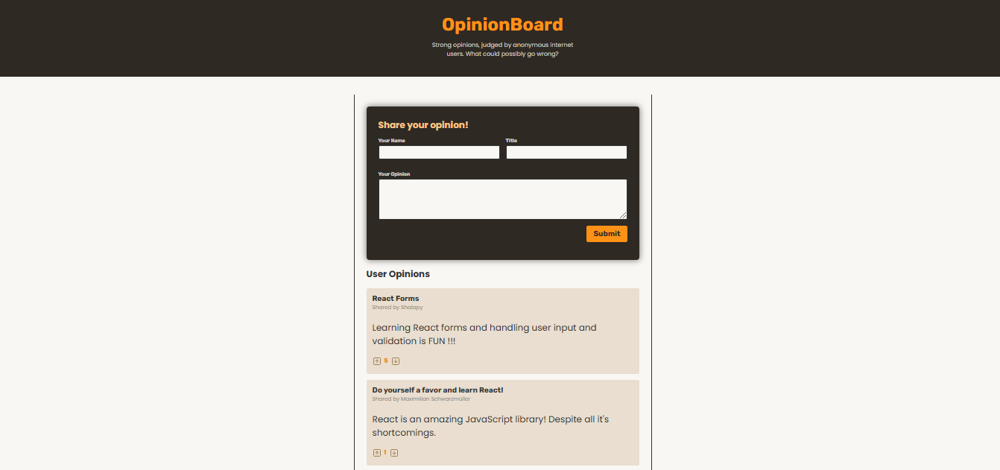
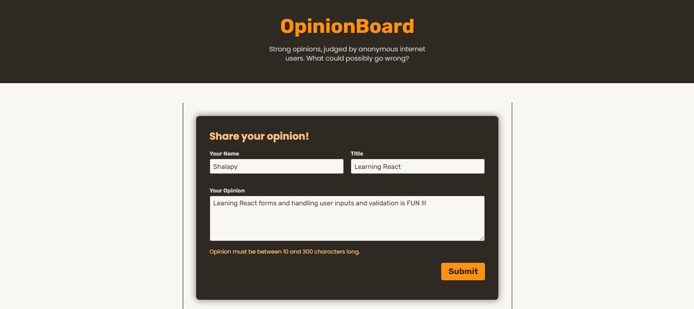
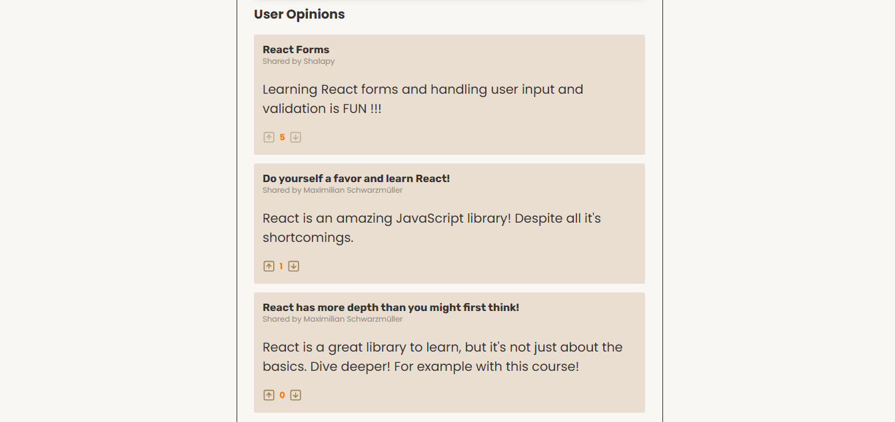

# OpinionBoard

[](https://react.dev/)


OpinionBoard is a feature-rich React application designed to allow users to share, upvote, or downvote opinions in an interactive environment. It showcases modern React development practices, including context-based state management, form validation, and asynchronous HTTP request handling.

## Project Overview

### Overview



### User Input Form Overview



### Users Opinions Overview



## Features

<!-- prettier ignore  -->

- User Input Handling:

  - Users can submit opinions with titles, body text, and usernames via an interactive form.

- Form Validation:

  - Real-time validation ensures title, body, and username meet specified criteria before submission.

- Context API:

  - Global state management using the Context API for handling opinions and votes efficiently.

- HTTP Requests:

  - Asynchronous communication with a backend to fetch, post, and update opinion data via RESTful endpoints.

- Voting System:

  - Users can upvote or downvote opinions, with optimistic UI updates ensuring smooth feedback.

- Dynamic UI Rendering:
  - Opinions are rendered dynamically, reflecting real-time changes from user interactions.

## Usage

1. Open the app in your browser.
2. Use the form to submit an opinion.
3. Browse opinions rendered dynamically in the UI.
4. Upvote or downvote opinions to reflect your agreement or disagreement.

## Project Structure

```
OpinionBoard
│      .gitignore
│      .vite.config
│      index.html
│      package-lock.json
│      package.json
│      README.md
│
│
└───public
│   vite.svg
│   overview.png
│   userInput.png
│   userOpinion.png
│
│
└───backend
│    app.js
│    db.json
│    package-lock.json
│    package.json
│
└───src
    │   App.jsx
    │   main.jsx
    │   index.css
    │
    ├───assets
    │      react.svg
    │
    ├───components
    │      Header.jsx
    │      NewOpinion.jsx
    │      Opinion.jsx
    │      Opinions.jsx
    │      Submit.jsx
    │
    ├───store
    │      opinions-context.jsx
    │
```

## Installation

To get started with the project locally:

1. Clone the repository:
   ```bash
   git clone https://github.com/SalahShallapy/OpinionBoard.git
   ```
2. Navigate to the project directory:
   ```bash
   cd OpinionBoard
   ```
3. Navigate to the backend directory:
   ```bash
   cd backend
   ```
4. Install backend dependencies:
   ```bash
   npm install
   ```
5. Run the backend server:
   ```bash
   npm start
   ```
6. Navigate out of the backend directory to the main project directory:
   ```bash
   cd ..
   ```
7. Install dependencies:
   ```bash
   npm install
   ```
8. Run the project:
   ```bash
   npm run dev
   ```

## Note

- This project's backend is locally setup and is not running on a server so you have to follow the installing steps and start the backend server in order to see the fetched data on the frontend UI

## Contributing

Contributions are what make the open source community such an amazing place to learn, inspire, and create. Any contributions you make are **greatly appreciated**.

If you have a suggestion that would make this better, please fork the repo and create a pull request. You can also simply open an issue with the tag "enhancement".
Don't forget to give the project a star! Thanks!

1.  Fork the Project
2.  Create your Feature Branch (`git checkout -b feature/AmazingFeature`)
3.  Commit your Changes (`git commit -m 'Add some AmazingFeature'`)
4.  Push to the Branch (`git push origin feature/AmazingFeature`)
5.  Open a Pull Request

   <p align="right">(<a href="#top">back to top</a>)</p>
